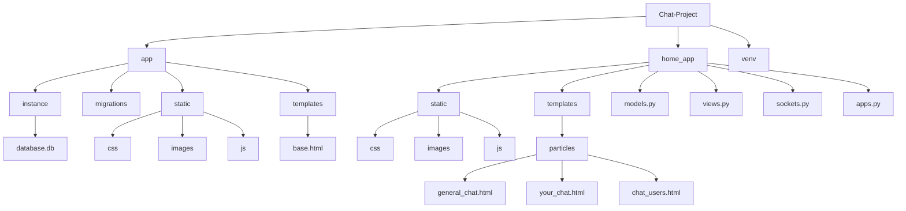
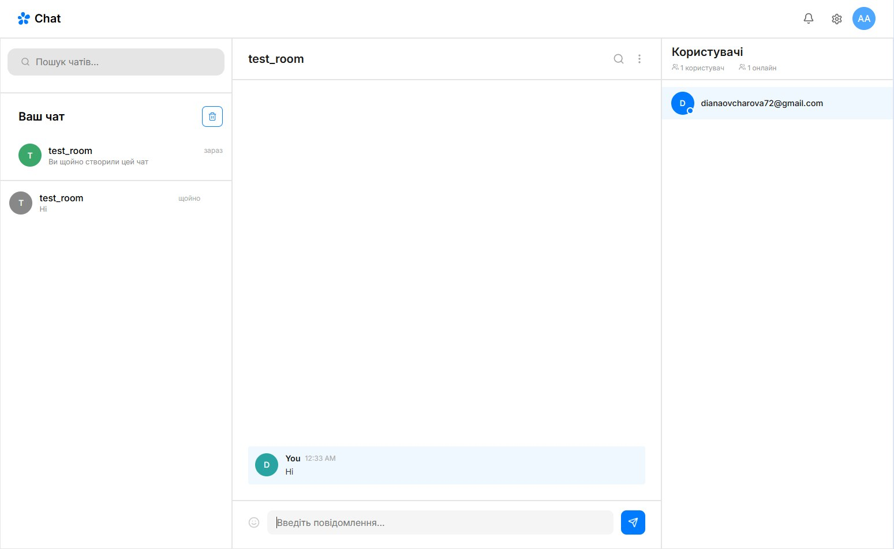

<h1 align="center">Chat-Project</h1>
 
<p align="center">Flask + Socket.IO real-time chat application</p>
<a name="contents"><h3>Зміст / Table of contents</h3></a>
 
# Мета проєкту
<h5>Project goal</h5>
 
[Мета створення проєкту](#description)
 
# Склад команди
<h5>Team</h5>
 
[Інформація про команду](#team)
 
# Перелік модулів та технологій
<h5>Modules and technologies</h5>
 
[Modules and technologies](#modules)
 
# Як запустити проєкт
<h5>How to run the project</h5>
 
[Run instructions](#run)
 
# Зміст проєкту
<h5>Project content</h5>
 
[Project structure and apps](#structure)
 
# Проблеми під час розробки
<h5>Problems during development</h5>
 
[Problems during development](#problems)
 
# Висновок
<h5>Conclusion</h5>
 
[Conclusion](#conclusion)
 
---
 
<a name="description"><h1>Мета створення проєкту</h1></a>
 
Метою цього проєкту є практичне засвоєння принципів повноцінної веб-розробки на Flask: робота з реляційними базами даних через SQLAlchemy, реалізація автентифікації користувачів, побудова REST-подібних маршрутів та, що найважливіше, впровадження обміну даними в реальному часі за допомогою WebSocket (Flask-SocketIO).
 
Chat-Project — це навчальний месенджер, який дозволяє користувачам реєструватися, підтверджувати email, створювати власний чат, шукати та приєднуватися до чужих чатів, спілкуватися в реальному часі, бачити статус "онлайн/офлайн" інших учасників та переглядати профілі користувачів. Проєкт буде корисний початківцю, який хоче на практиці зрозуміти, як влаштована взаємодія між Flask-сервером, базою даних та клієнтом через звичайні HTTP-запити (`fetch`) і через постійне WebSocket-з'єднання — а також побачити різницю між цими двома підходами в одному реальному застосунку.
 
<details>
<summary> English version </summary>
The goal of this project is to practically master the principles of full-stack web development with Flask: working with relational databases via SQLAlchemy, implementing user authentication, building REST-like routes and, most importantly, implementing real-time data exchange using WebSocket (Flask-SocketIO).
Chat-Project is an educational messenger that allows users to register, verify their email, create their own chat, search for and join other chats, communicate in real time, see the online/offline status of other participants, and view user profiles. The project will be useful for a beginner who wants to understand in practice how the interaction between a Flask server, a database, and a client works through regular HTTP requests (`fetch`) and through a persistent WebSocket connection — and to see the difference between these two approaches within one real application.
</details>

[Return to table of contents](#contents)
 
<a name="team"><h1>Склад команди</h1></a>
 
1. GitHub - [Diana - Team Lead, Developer](https://github.com/dianaaao)
2. GitHub - [Arseni - Developer](https://github.com/arseninesmasny)
3. GitHub - [Danylo - Developer](https://github.com/Danylo-sys)
4. GitHub - [Denis - Developer](https://github.com/mifaryk)

[Return to table of contents](#contents)
 
<a name="modules"><h1>Перелік модулів та технологій</h1></a>
 
Проєкт побудований на наступному стеку:
 
| Технологія | Версія | Призначення |
|---|---|---|
| Flask | 3.1.3 | основний веб-фреймворк |
| Flask-SQLAlchemy | 3.1.1 | ORM для роботи з БД |
| Flask-Migrate | 4.1.0 | міграції бази даних |
| Flask-Login | 0.6.3 | автентифікація користувачів |
| Flask-SocketIO | 5.6.1 | обмін даними в реальному часі (WebSocket) |
| python-socketio / python-engineio | 5.16.2 / 4.13.2 | транспортний рівень для SocketIO |
| SQLAlchemy | 2.0.49 | рушій ORM |
| python-dotenv | 1.2.2 | зберігання конфігурації в `.env` |
| Jinja2 | 3.1.6 | шаблонізатор для рендеру HTML |
| SQLite | — | база даних проєкту |
 
На клієнті: чистий HTML / CSS / JavaScript, бібліотека `socket.io-client` для підключення до WebSocket.
 
<details>
<summary> English version </summary>
The project is built on the following stack: Flask as the main web framework, Flask-SQLAlchemy as ORM, Flask-Migrate for database migrations, Flask-Login for user authentication, Flask-SocketIO for real-time data exchange (WebSocket), python-socketio/python-engineio as the transport layer, SQLAlchemy as the ORM engine, python-dotenv for storing configuration in `.env`, Jinja2 as the template engine, and SQLite as the project's database. On the client side: plain HTML/CSS/JavaScript and the `socket.io-client` library for connecting to the WebSocket.
</details>

[Return to table of contents](#contents)
 
<a name="run"><h1>Як запустити проєкт</h1></a>
 
1. Клонувати репозиторій та перейти в папку проєкту:
```bash
git clone <repository-url>
cd Chat-project
```
 
2. Створити та активувати віртуальне середовище:
```bash
python -m venv venv
venv\Scripts\activate      # Windows
source venv/bin/activate   # Linux / macOS
```
 
3. Встановити залежності:
```bash
pip install -r requirements.txt
```
 
4. Створити файл `.env` за прикладом `.env.example` і заповнити власні значення:
```env
SECRET_KEY = ""
 
MSG_HOST = ''
MSG_PORT = 
MSG_EMAIL = ""
MSG_PASSWORD = ''
```
`MSG_*` змінні потрібні для відправки листа підтвердження email через SMTP після реєстрації.
 
5. Застосувати міграції бази даних:
```bash
flask db upgrade
```
 
6. Запустити проєкт:
```bash
python manage.py
```
 
Сервер стартує на `http://127.0.0.1:8080` через `socketio.run(app, port=8080, debug=True)`.
 
<details>
<summary> English version </summary>
1. Clone the repository and go to the project folder. 2. Create and activate a virtual environment. 3. Install dependencies with `pip install -r requirements.txt`. 4. Create a `.env` file based on `.env.example` and fill in your own values — `SECRET_KEY` and the `MSG_*` variables, which are required to send a confirmation email via SMTP after registration. 5. Apply database migrations with `flask db upgrade`. 6. Run the project with `python manage.py`. The server starts at `http://127.0.0.1:8080` via `socketio.run(app, port=8080, debug=True)`.
</details>

[Return to table of contents](#contents)
 
<a name="structure"><h1>Зміст проєкту</h1></a>
 

 
### Опис застосунків (Blueprint'ів)
 
Проєкт організовано через декілька Flask Blueprint'ів, кожен відповідає за окрему частину застосунку:
 
**`registration`** — реєстрація нового користувача. Приймає email і пароль, перевіряє унікальність email, хешує пароль (`werkzeug.security`), створює користувача зі статусом `is_verified=False` і надсилає лист підтвердження на email через SMTP.
 
**`login`** — авторизація вже зареєстрованого користувача через `flask_login.login_user`, перевірка хешу пароля.
 
**`success_page`** — проміжна сторінка, яка показується після успішної реєстрації, поки користувач не підтвердив email.
 
**`main_page`** — головний застосунок чату. Містить усі основні маршрути: створення/видалення власного чату, пошук і приєднання до чужих чатів, отримання списку чатів та повідомлень, отримання списку учасників чату, отримання профілю користувача, вихід з чату.
 
### Опис ключових моделей бази даних
 
```python
class User(DATABASE.Model, flask_login.UserMixin):
    id = DATABASE.Column(DATABASE.Integer, primary_key=True)
    email = DATABASE.Column(DATABASE.String(255), nullable=False, unique=True)
    password_hash = DATABASE.Column(DATABASE.String(255))
    username = DATABASE.Column(DATABASE.String(255), unique=True)
    is_verified = DATABASE.Column(DATABASE.Boolean, default=False)
    groups = DATABASE.relationship("Group", secondary="user_group", back_populates="users")
```
`User` — користувач застосунку. Зв'язується з чатами через допоміжну таблицю `UserGroup` (many-to-many).
 
```python
class Group(DATABASE.Model):
    id = DATABASE.Column(DATABASE.Integer, primary_key=True)
    group_name = DATABASE.Column(DATABASE.String(255))
    owner_id = DATABASE.Column(DATABASE.Integer, DATABASE.ForeignKey("user.id"), nullable=True)
    users = DATABASE.relationship("User", secondary="user_group", back_populates="groups")
```
`Group` — окремий чат. Кожен чат має власника (`owner_id`) і список учасників через `UserGroup`.
 
```python
class Message(DATABASE.Model):
    id = DATABASE.Column(DATABASE.Integer, primary_key=True)
    text = DATABASE.Column(DATABASE.Text, nullable=False)
    timestamp = DATABASE.Column(DATABASE.DateTime, default=lambda: datetime.now(timezone.utc))
    user_id = DATABASE.Column(DATABASE.Integer, DATABASE.ForeignKey("user.id"))
    group_id = DATABASE.Column(DATABASE.Integer, DATABASE.ForeignKey("group.id"))
    author = DATABASE.relationship("User", backref="messages")
```
`Message` — повідомлення в чаті, прив'язане до автора і групи. Час зберігається у часовому поясі UTC і конвертується в локальний час лише при відправленні клієнту.
 
### Робота в реальному часі (WebSocket)
 
Файл `sockets.py` обробляє події `connect`, `disconnect`, `join_room`, `leave_room`, `send_message`. При підключенні юзера сервер веде словник `online_users` — `{ user_id: set(sid) }` — це дозволяє коректно визначати онлайн-статус навіть якщо один користувач має кілька відкритих вкладок одночасно:
 
```python
@socketio.on("connect")
def handle_connect():
    if flask_login.current_user.id not in online_users.keys():
        online_users[flask_login.current_user.id] = set()
        socketio.emit("user_status_online", {"user_id": flask_login.current_user.id})
    online_users[flask_login.current_user.id].add(flask.request.sid)
```
 
При відправці повідомлення сервер зберігає його в БД і одразу транслює всім учасникам кімнати чату:
 
```python
@socketio.on("send_message")
def handle_send_message(data):
    msg = Message(text=data["text"], user_id=flask_login.current_user.id, group_id=data["groupId"])
    DATABASE.session.add(msg)
    DATABASE.session.commit()
    flask_socketio.emit("new_message", {
        "text": data["text"],
        "userId": flask_login.current_user.id,
        "time": msg.timestamp.strftime('%I:%M %p')
    }, to=f'room_{data["groupId"]}')
```
 
 

 
[Return to table of contents](#contents)
 
<a name="problems"><h2>Проблеми під час розробки</h2></a>
 
### Розбіжність назв полів між моделлю та маршрутами
Однією з найчастіших помилок було використання `Message.timestamp` в одних файлах та `Message.time_stamp` в інших — SQLite одразу видавав `OperationalError: no such column`. Рішення — уніфікувати назву поля в моделі та звіряти всі звернення до нього в `views.py` і `sockets.py`.
 
### Конфлікт `position: fixed` через невалідний медіа-запит
Модальні вікна на мобільній версії відображались зі зсувом, хоча `position: fixed` коректно центрував їх. Причина — в медіа-запиті був написаний `@media (max-width: 480)` без одиниці `px`, через що правило вважалось невалідним і повністю ігнорувалось браузером.
 
### `default=datetime.now()` без `lambda` в моделі
Якщо в `Column(default=...)` передати виклик функції одразу (`datetime.now(timezone.utc)`), SQLAlchemy обчислює значення один раз при старті сервера, і всі наступні записи отримують однаковий час. Виправлено через `default=lambda: datetime.now(timezone.utc)`, що обчислює значення при кожному створенні запису.
 
### Видалення запису з активними зовнішніми ключами
При видаленні чату виникала помилка `FOREIGN KEY constraint failed`, оскільки повідомлення (`Message`) і записи учасників (`UserGroup`) залишались прив'язаними до видаленої групи. Вирішено порядком видалення: спочатку повідомлення, потім зв'язки учасників, і лише тоді саму групу.
 
### Оновлення даних у реальному часі без перезавантаження сторінки
Спершу видалення чату чи зміна статусу учасника відображались тільки після `location.reload()`. Це суперечило самій ідеї real-time застосунку. Рішення — додаткові SocketIO-події (`chat_deleted`, `members_updated`, `system_message`), які транслюються всім підключеним клієнтам і оновлюють DOM без перезавантаження.
 
### Масштабування мобільного інтерфейсу на iOS
На iPhone інтерфейс виходив за межі екрана через виїмку (Dynamic Island) та індикатор жестів знизу, а також через зум при фокусі на полі вводу. Вирішено додаванням `viewport-fit=cover` та CSS-змінних `env(safe-area-inset-top/bottom)`, а також встановленням `font-size: 16px` на всіх `<input>`, щоб iOS Safari не збільшував масштаб автоматично.
 
<details>
<summary> English version </summary>
During development, the following issues were encountered: inconsistent field naming between the model (`timestamp`) and routes (`time_stamp`), causing SQLite `OperationalError`; modal windows on mobile being misaligned due to an invalid media query (`max-width: 480` without the `px` unit); all messages receiving the same timestamp because `default=datetime.now(...)` was evaluated once at server startup instead of using a `lambda`; a `FOREIGN KEY constraint failed` error when deleting a chat that still had related messages and members, solved by deleting in the correct order (messages → memberships → group); UI updates (chat deletion, member status) requiring a full page reload, solved by introducing dedicated SocketIO events (`chat_deleted`, `members_updated`, `system_message`) broadcast to all connected clients; and mobile layout issues on iPhone caused by the notch/home indicator and input auto-zoom, solved with `viewport-fit=cover`, `env(safe-area-inset-*)` CSS variables, and a minimum `16px` font size on all inputs.
</details>

[Return to table of contents](#contents)
 
<a name="conclusion"><h2>Висновок</h2></a>
 
У результаті розробки Chat-Project було створено повноцінний месенджер на Flask з підтримкою реєстрації та підтвердження email, створенням і пошуком чатів, обміном повідомленнями в реальному часі через WebSocket, відображенням онлайн-статусу учасників та переглядом профілів користувачів. Під час роботи над проєктом було здобуто практичні навички роботи з Flask Blueprint'ами, ORM-моделями та зв'язками many-to-many через SQLAlchemy, автентифікацією через Flask-Login, а також глибше зрозуміло принципову різницю між класичними HTTP-запитами (`fetch`) і постійним WebSocket-з'єднанням (`Flask-SocketIO`) для побудови застосунків реального часу. Окремо було отримано досвід адаптації інтерфейсу під мобільні пристрої з урахуванням специфічних обмежень iOS Safari. Здобутий досвід можна розвивати далі — додаванням групових ролей (адміністратор/учасник), системи сповіщень, шифрування повідомлень, а також збереження статусу "перший вхід в чат" не лише в оперативній пам'яті, а й у базі даних, щоб системні повідомлення коректно працювали навіть після перезапуску сервера.
 
<details>
<summary> English version </summary>
As a result of developing Chat-Project, a full-featured messenger was built on Flask with support for registration and email confirmation, chat creation and search, real-time messaging via WebSocket, online status display for members, and user profile viewing. During development, practical skills were gained in working with Flask Blueprints, ORM models and many-to-many relationships via SQLAlchemy, authentication via Flask-Login, and a deeper understanding of the fundamental difference between classic HTTP requests (`fetch`) and a persistent WebSocket connection (`Flask-SocketIO`) for building real-time applications. Additional experience was gained in adapting the interface for mobile devices, taking into account specific iOS Safari constraints. This experience can be developed further by adding group roles (admin/member), a notification system, message encryption, and persisting the "first join" status to the database instead of memory, so that system messages work correctly even after a server restart.
</details>

[Return to table of contents](#contents)